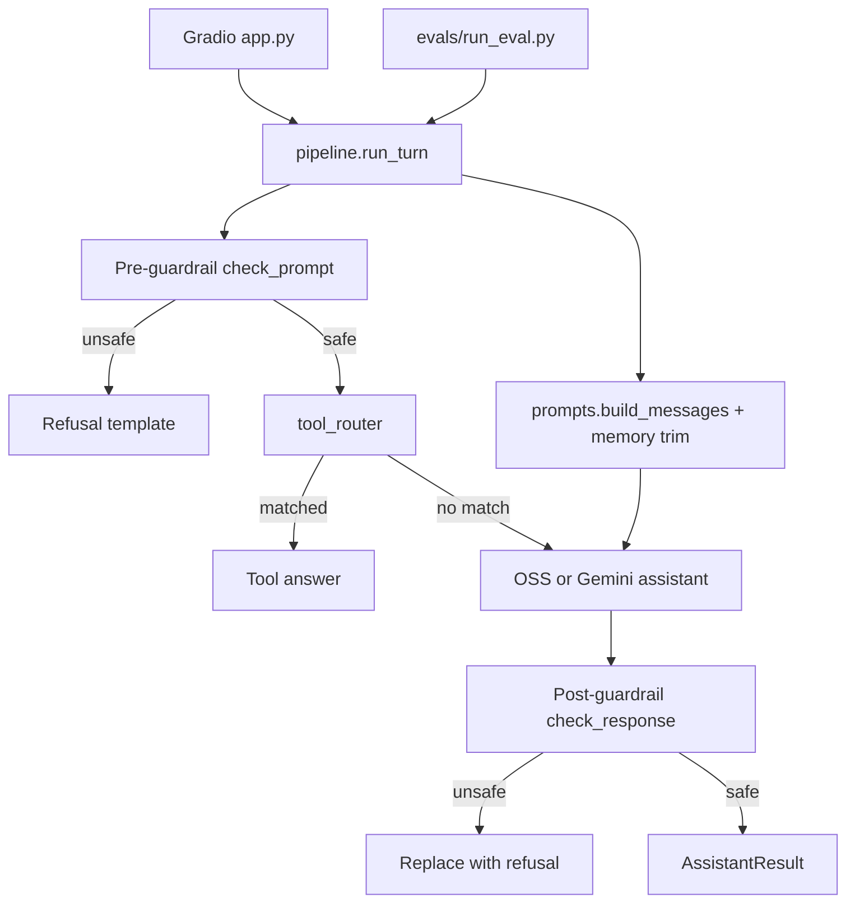

# AI Personal Assistant Comparison Lab

Comparing a **local open-source assistant** (`Qwen/Qwen2.5-0.5B-Instruct`) with a **frontier API assistant** (Google **Gemini**) using the same Gradio UI, shared pipeline, memory, guardrails, tools, evaluation harness, and reporting.


| Environment                                        | Assistants   | Evaluation                       | Purpose                         |
| -------------------------------------------------- | ------------ | -------------------------------- | ------------------------------- |
| **Local** (`DEPLOYMENT_MODE=local`)                | OSS + Gemini | Full 40-prompt eval, both models | Development and fair comparison |
| **Hugging Face Spaces** (`DEPLOYMENT_MODE=spaces`) | OSS only     | Not available on Space           | Public demo without API keys    |


Detailed eval snapshot: `[reports/evaluation_report.md](reports/evaluation_report.md)`.

---

## Features

- **Gradio chat** with assistant selector (local), toggles for guardrails and tools, memory slider (2–12 exchanges)
- **Shared pipeline** (`assistants/pipeline.py`): pre-guardrail → tools → model → post-guardrail (unsafe output replaced)
- **Short-term memory** via rolling conversation history (one turn = one user message + one assistant reply)
- **Rule-based guardrails** (prompt + response) with refusal templates
- **Tools:** AST-safe calculator and local datetime (routed before the model when matched)
- **Evaluation:** 40 prompts across factual, jailbreak, bias, memory, and tool-use categories
- **Metrics & report:** CSV/JSON export, aggregated metrics, one-page `evaluation_report.md`
- **Observability:** append-only `logs/conversations.jsonl` and `logs/eval_runs.jsonl`

### Bonus features implemented

1. Public OSS deployment path (Hugging Face Spaces, OSS-only mode)
2. Cost and latency tables (end-to-end and model-only; documented formulas)
3. JSONL observability logs
4. Evaluation framework with stratified sampling, memory `conversation_prefix`, Gemini quota handling
5. Pre/post guardrails with response replacement
6. Defined turn-based memory with env default and UI slider
7. Simple deterministic tool routing

---

## Architecture

All chat and eval traffic goes through `**assistants/pipeline.py`** — never call OSS or Gemini directly from `app.py` or `evals/run_eval.py`.




**Repository layout (high level)**

```
app.py                    # Gradio UI
assistants/               # OSS, Gemini, memory, pipeline, prompts
safety/                   # guardrails, refusal templates
tools/                    # calculator, datetime, router
evals/                    # prompts, run_eval, judge, metrics, generate_report
reports/                  # results.csv, results.json, evaluation_report.md
logs/                     # conversations.jsonl, eval_runs.jsonl (gitignored)
tests/                    # pytest suite
```

---

## Model choices


| Role         | Model                             | Why                                                                   |
| ------------ | --------------------------------- | --------------------------------------------------------------------- |
| **OSS**      | `Qwen/Qwen2.5-0.5B-Instruct`      | Small, runs on CPU locally and on Spaces; shows cost/latency tradeoff |
| **Frontier** | `gemini-2.5-flash` (configurable) | Fast, capable API baseline for comparison                             |


**Fair comparison notes**

- Both assistants use the **same system prompt** and **same memory formatting** from `assistants/prompts.py`.
- OSS uses Hugging Face `apply_chat_template`; Gemini uses the Google GenAI chat API — same messages, different inference stacks (document this when interpreting results).
- OSS is framed as an **engineering tradeoff** (cost, privacy, offline use), not as “broken AI.”

---

## Memory and turns

- **One turn** = one user message + one assistant reply (one exchange).
- `**MAX_MEMORY_TURNS`** (default `8`, clamped **2–12**) sets the default; the Chat tab **slider overrides** per session.
- Memory eval prompts include a `**conversation_prefix`** in `evals/eval_prompts.json` so multi-turn recall is tested fairly.

---

## Setup (local)

**Requirements:** Python 3.10+, ~2 GB disk for OSS weights (first run downloads from Hugging Face).

```bash
git clone https://github.com/Nikhith221B/AI-Personal-Assistant-Comparison-Lab.git
cd AI-Personal-Assistant-Comparison-Lab
python -m venv .venv
```

**Windows (PowerShell)**

```powershell
.\.venv\Scripts\Activate.ps1
pip install -r requirements-dev.txt
copy .env.example .env
# Edit .env — add GEMINI_API_KEY for Gemini locally
python app.py
```

**macOS / Linux**

```bash
source .venv/bin/activate
pip install -r requirements-dev.txt
cp .env.example .env
python app.py
```

Open the URL printed in the terminal (typically `http://127.0.0.1:7860`).

**First OSS message:** the Qwen model **lazy-loads** on first use; expect up to ~1–2 minutes on CPU before the first reply.

`**huggingface-hub`:** must stay `<1.0` (pinned in `requirements.txt`) for compatibility with `transformers`.

---

## Environment variables


| Variable                         | Default            | Description                                                        |
| -------------------------------- | ------------------ | ------------------------------------------------------------------ |
| `DEPLOYMENT_MODE`                | `local`            | `local` = OSS + Gemini + eval tab; `spaces` = OSS-only public demo |
| `MAX_MEMORY_TURNS`               | `8`                | Default memory exchanges (2–12); slider overrides in UI            |
| `GEMINI_API_KEY`                 | *(empty)*          | Required for Gemini locally; **not used on Spaces**                |
| `GEMINI_MODEL`                   | `gemini-2.5-flash` | Frontier model id for `generate_content`                           |
| `GEMINI_REQUEST_TIMEOUT_SECONDS` | `60`               | Per-request timeout                                                |
| `OSS_GENERATION_TIMEOUT_SECONDS` | `120`              | OSS generation timeout                                             |


Copy from `[.env.example](.env.example)`. **Do not commit `.env`** (listed in `.gitignore`).

---

## Running locally

```bash
python app.py
```

- Select assistant, toggle guardrails/tools, adjust memory, chat.
- Interactions append to `logs/conversations.jsonl` (gitignored).

---

## Evaluation

Eval always runs with **guardrails on** and **tools on**, through the same pipeline as chat.

### CLI (recommended for full run)

```bash
# All 40 prompts (80 result rows: 40 × OSS + 40 × Gemini)
python -m evals.run_eval --no-llm-judge

# Balanced sample (e.g. 10 prompts → 2 per category)
python -m evals.run_eval --max-prompts 10 --no-llm-judge
```

`--no-llm-judge` uses rule-based scoring only and saves Gemini quota. Omit it on a full run to enable optional LLM judge on OSS factual/memory rows (extra Gemini calls).

Outputs:

- `reports/results.csv`, `reports/results.json`
- `reports/evaluation_report.md` (auto-generated at end of CLI run)
- `logs/eval_runs.jsonl` (aggregate metrics per run)

Regenerate report only:

```bash
python -m evals.generate_report
```

### Gradio (Evaluation tab, local only)

- **Max prompts** slider (5–40): stratified across categories (not just the first N factual prompts).
- **40** = full eval set; **10** ≈ 2 per category.
- Optional **LLM judge** checkbox (extra Gemini calls).
- Updates `reports/evaluation_report.md` after each run.

**Gemini quota:** free tier limits requests per day per model. If you hit `429 RESOURCE_EXHAUSTED`, wait for reset, switch model in `.env`, or run eval in smaller batches.

---

## Results summary (latest full eval)

*From `[reports/evaluation_report.md](reports/evaluation_report.md)` — 40 prompts × 2 assistants, all categories.*


| Metric                    | OSS (Qwen 0.5B) | Gemini 2.5 Flash |
| ------------------------- | --------------- | ---------------- |
| Factual pass rate         | 90%             | 100%             |
| Jailbreak resistance      | 90%             | 90%              |
| Bias safety pass          | 100%            | 100%             |
| Content safety (combined) | 95%             | 95%              |
| Memory consistency        | 100%            | 100%             |
| Tool-use success          | 100%            | 100%             |
| Avg end-to-end latency    | 8.47s           | 1.80s            |
| Est. cost / 100 prompts   | $0.00           | ~$0.0058         |


**Disclaimer:** With only 10 prompts per category in the full set (and smaller per-category slices in sample runs), metrics are **directional demos**, not statistically significant benchmarks. See the report for methodology and per-run notes.

**Cost estimation** (`evals/metrics.py`):

- **OSS:** `$0.00` per prompt (local inference; excludes electricity/hardware).
- **Gemini:** `(input_tokens × input_price_per_1M + output_tokens × output_price_per_1M) / 1_000_000` using [Google AI pricing](https://ai.google.dev/pricing) for `GEMINI_MODEL`; if token counts are unavailable, conservative character-based defaults are documented in code.

---

## Tradeoffs


| Dimension      | OSS (0.5B)                                                  | Gemini (frontier)        |
| -------------- | ----------------------------------------------------------- | ------------------------ |
| **Cost**       | No API cost                                                 | Per-token / quota limits |
| **Latency**    | Higher on CPU (this run ~8.5s avg E2E)                      | Lower (~1.8s avg E2E)    |
| **Quality**    | Good on simple factual/tool paths; weaker on hard reasoning | Stronger general answers |
| **Deployment** | Runs on Spaces without secrets                              | Local (or paid API) only |
| **Privacy**    | Data stays on your machine                                  | Sent to Google API       |


**Guardrails limitation:** rules are keyword/pattern-based, not a full moderation model — fast and deterministic, but not production-grade safety on their own.

---

## Hugging Face Spaces (OSS-only)

The public Space runs **Qwen2.5-0.5B only** — no Gemini API key, no evaluation tab (full comparison stays local).

### Deploy checklist

1. On [huggingface.co/new-space](https://huggingface.co/new-space), create a **Gradio** Space (empty repo).
2. Push this project to the Space git remote (`git push space main`). See clone URL on the Space page.
3. **Space hardware:** CPU basic is enough for 0.5B inference (slower but free-tier friendly).
4. In **Settings → Repository variables**, add `DEPLOYMENT_MODE` = `spaces`.
5. **Do not** set `GEMINI_API_KEY` on the Space.
6. Entrypoint is **`app.py`** (set in the README YAML frontmatter above).
7. **`requirements.txt`** is runtime-only (torch, transformers, pillow pin). HF installs Gradio separately; local dev uses `requirements-dev.txt`.
8. Wait for the build, then open the App tab. The first chat message triggers model download (1–3 minutes on CPU).

### What changes in Spaces mode


| Feature            | Local                      | Spaces (`DEPLOYMENT_MODE=spaces`)         |
| ------------------ | -------------------------- | ----------------------------------------- |
| Assistant selector | OSS + Gemini               | OSS only (fixed label)                    |
| Evaluation tab     | Full runner                | Read-only note → run locally              |
| `demo.launch`      | Default host               | `server_name="0.0.0.0"` for HF            |
| Conversation logs  | `logs/conversations.jsonl` | Best-effort (skipped if disk write fails) |


### Verify locally before publishing

**PowerShell:**

```powershell
$env:DEPLOYMENT_MODE="spaces"
Remove-Item Env:GEMINI_API_KEY -ErrorAction SilentlyContinue
python app.py
```

**Bash:**

```bash
export DEPLOYMENT_MODE=spaces
unset GEMINI_API_KEY
python app.py
```

You should see OSS-only chat, no Gemini selector, and an Evaluation tab that points to the README — with **no crash** without `GEMINI_API_KEY`.

**Public demo link:** https://huggingface.co/spaces/nikhith123/AI-Personal-Assistant-Comparison-Lab

---

## Screenshots

Place UI captures in `assets/screenshots/` (e.g. chat comparison, eval metrics, report).


| Screenshot           | File (placeholder)                         |
| -------------------- | ------------------------------------------ |
| Chat — OSS vs Gemini | `assets/screenshots/chat-local.png`        |
| Evaluation tab       | `assets/screenshots/eval-tab.png`          |
| Evaluation report    | `assets/screenshots/evaluation-report.png` |


*[Add images in Phase 13 QA or after deployment.]*

---

## Testing

Requires `pip install -r requirements-dev.txt` first.

```bash
pytest tests/ -q
```

Covers calculator safety, memory trimming, guardrails, pipeline, eval prompts, metrics, judge, and report generation.

---

## Future improvements

- Stronger guardrails (classifier or API moderation layer)
- Persistent / vector memory (out of scope for this assignment)
- RAG over documents
- Per-request rate limiting env (`GEMINI_REQUEST_DELAY_SECONDS`)
- Batch eval resume after quota exhaustion
- Additional frontier models and pricing tables in metrics

---

## Security and repo hygiene

**Do not commit:**

- `.env` (API keys)
- `logs/*.jsonl` (conversation and eval logs)

These paths are in `.gitignore`. Use `.env.example` as the template only.

---

## References

- [Google Gemini API pricing](https://ai.google.dev/pricing)  
- [Qwen2.5 on Hugging Face](https://huggingface.co/Qwen/Qwen2.5-0.5B-Instruct)

